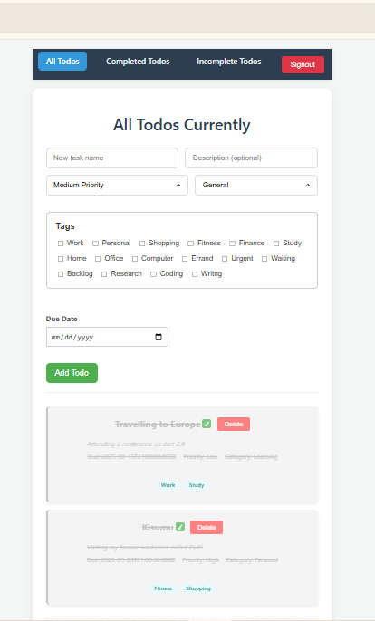

# Todo Application
This is a react todo app demostrating the CRUD Operations. Key concepts here is to know how to use react hooks

## App Screenshot

## Key Features
1. Adding todo task
2. Deleting the todo task
3. Marking the todo task as complete

## How To Run the App
1. Clone it
2. Run *npm install*
3. Run *npm start*
4. Wait it will open on the default port 3000, or once it is done you can open the browser and type in htt://localhost:3000 

